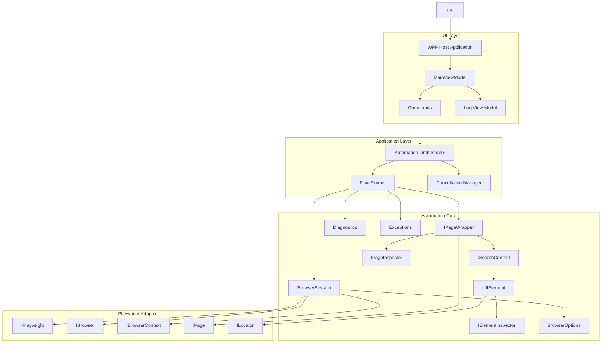
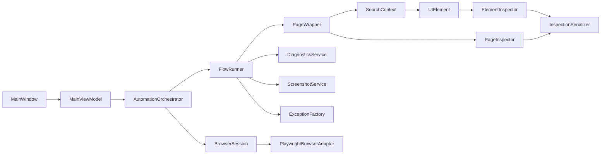
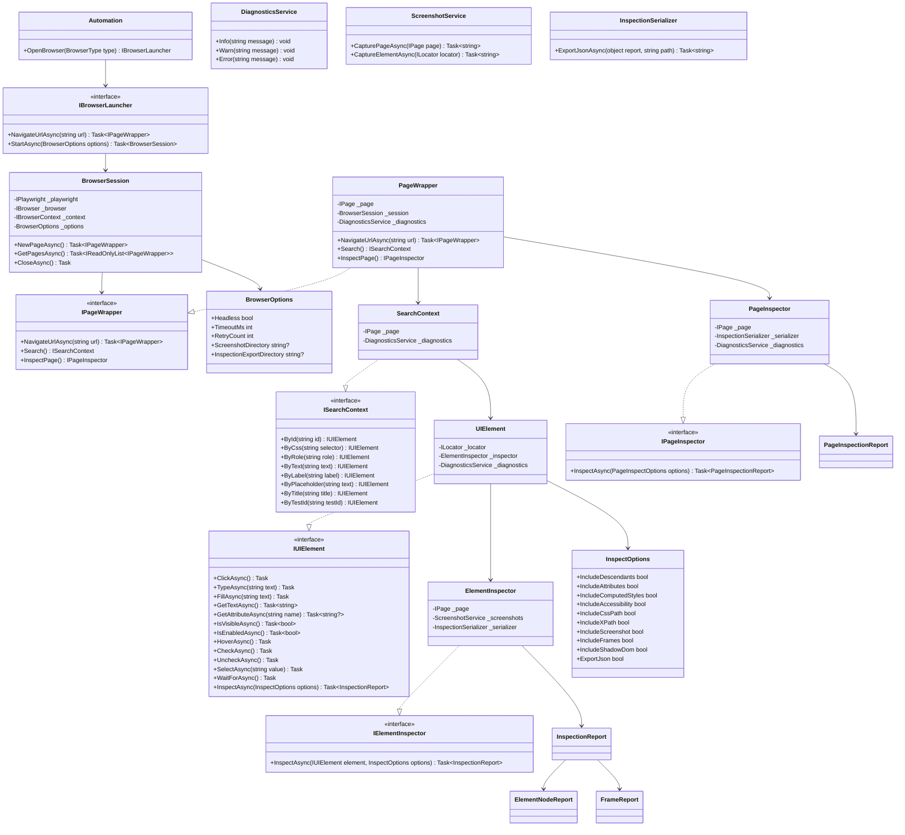
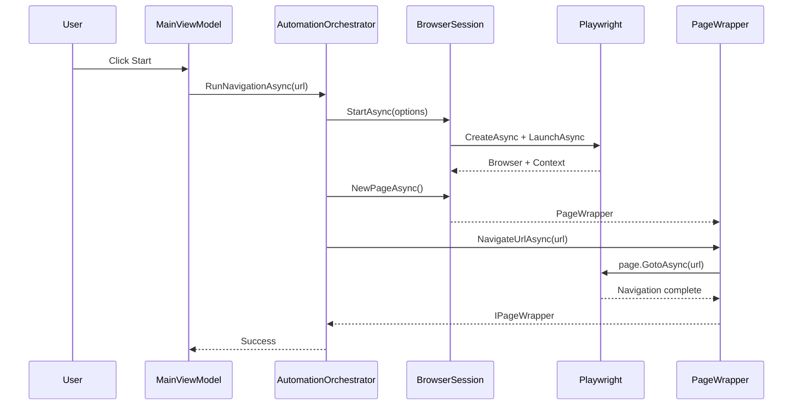
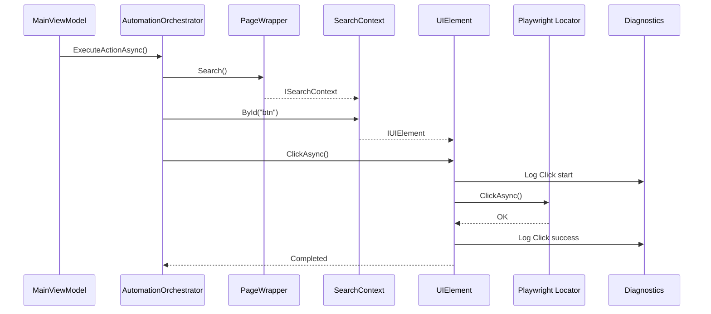
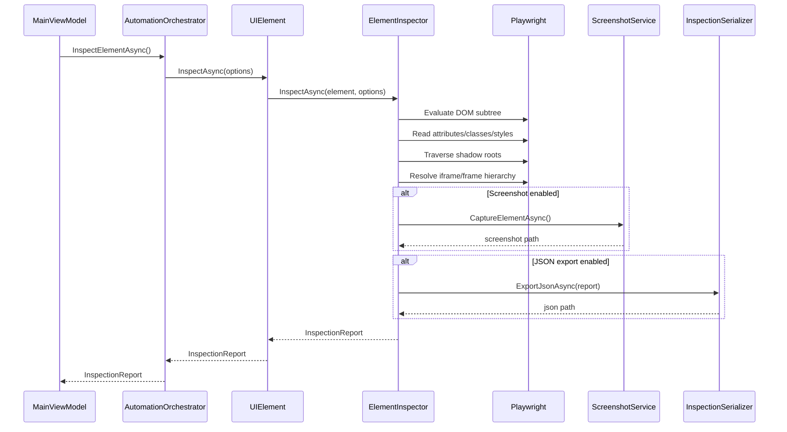
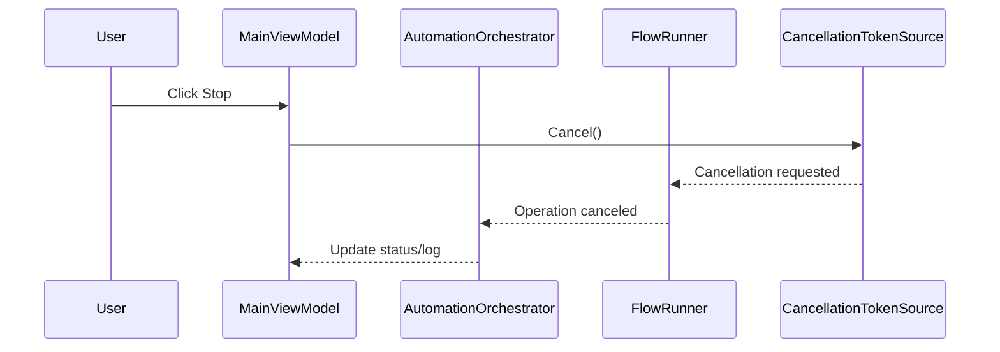

# WPF Automation Framework (Playwright-Based) PRD

## 1. Objective
Build a .NET 10 WPF application plus reusable automation library that wraps Microsoft.Playwright into a fluent, domain-style API.

The solution must provide:
- A WPF host application
- A reusable automation class library
- A fluent API for navigation, search, interaction, and inspection
- Strong diagnostics, screenshots, cancellation, and logging
- Inspection of normal DOM, iframes, and shadow DOM
- Optional JSON export for inspection reports

---

## 2. Product Goal
Provide a WPF-hosted browser automation framework with:
- Fluent page navigation
- Search and element interaction
- Page, frame, and shadow DOM inspection
- Action logging
- Failure diagnostics
- Cancellation support
- Multi-browser support

Target usage style:

```csharp
var page = await OpenBrowser(BrowserType.Chromium)
    .NavigateUrlAsync("https://example.com");

var button = page.Search().ById("btn");
await button.ClickAsync();
```

Inspection usage:

```csharp
var card = page.Search().ById("customer-card");

var report = await card.InspectAsync(new InspectOptions
{
    IncludeDescendants = true,
    IncludeComputedStyles = true,
    IncludeAccessibility = true,
    IncludeCssPath = true,
    IncludeXPath = true,
    IncludeScreenshot = true,
    IncludeFrames = true,
    IncludeShadowDom = true,
    ExportJson = true
});
```

---

## 3. Scope

### 3.1 In Scope for v1
- .NET 10 class library
- .NET 10 WPF host application
- MVVM-based UI
- Async-first API
- Browser launch and navigation
- Search API
- UI element abstraction
- Auto-wait and retry logic
- Screenshot-on-failure
- Logging/tracing
- Cancellation
- Multi-page support
- Chromium, Firefox, WebKit support
- Browser/page/element inspection
- iframe inspection
- shadow DOM inspection
- Optional JSON export for inspection

### 3.2 Out of Scope for v1
- File upload/download workflows
- Visual flow designer
- Code recorder
- AI-assisted selector generation
- Mobile/device emulation
- Distributed execution

---

## 4. Architecture Overview

### 4.1 Layers
1. **WPF UI Layer**
   - Start/Stop actions
   - URL input
   - Log viewer
   - Inspection viewer later
   - Background execution only

2. **Application Layer**
   - Orchestrates automation runs
   - Bridges MVVM commands to automation services
   - Manages session lifetime and cancellation

3. **Automation Core Library**
   - Browser lifecycle
   - Page abstraction
   - Search abstraction
   - UI element interaction
   - Inspection subsystem
   - Diagnostics subsystem
   - Exception model
   - Configuration model

4. **Playwright Adapter Layer**
   - Encapsulates Microsoft.Playwright primitives
   - Handles browser/context/page/locator translation

### 4.2 Main Modules
| Module | Responsibility |
|---|---|
| Browser | Launch browser, context, pages |
| Page | Navigation and page-level operations |
| Search | Find elements using locator-style methods |
| UIElement | Element interaction and state queries |
| Inspection | DOM, iframe, shadow DOM, styles, accessibility |
| Diagnostics | Logging, screenshots, debug metadata |
| Exceptions | Wrapped exceptions with enriched context |
| Config | Headless, timeout, retry, paths, options |

---

## 5. Architecture Diagram



---

## 6. Component Diagram



---

## 7. Core API Design

### 7.1 Entry Point
```csharp
var page = await OpenBrowser(BrowserType.Chromium)
    .NavigateUrlAsync("https://example.com");
```

### 7.2 Entry Interfaces
```csharp
public static class Automation
{
    public static IBrowserLauncher OpenBrowser(BrowserType type);
}
```

```csharp
public interface IBrowserLauncher
{
    Task<IPageWrapper> NavigateUrlAsync(string url);
    Task<BrowserSession> StartAsync(BrowserOptions options);
}
```

### 7.3 Browser Session
```csharp
public sealed class BrowserSession
{
    public Task<IPageWrapper> NewPageAsync();
    public Task<IReadOnlyList<IPageWrapper>> GetPagesAsync();
    public Task CloseAsync();
}
```

### 7.4 Page Abstraction
```csharp
public interface IPageWrapper
{
    Task<IPageWrapper> NavigateUrlAsync(string url);
    ISearchContext Search();
    IPageInspector InspectPage();
}
```

### 7.5 Search API
```csharp
public interface ISearchContext
{
    IUIElement ById(string id);
    IUIElement ByCss(string selector);
    IUIElement ByRole(string role);
    IUIElement ByText(string text);
    IUIElement ByLabel(string label);
    IUIElement ByPlaceholder(string text);
    IUIElement ByTitle(string title);
    IUIElement ByTestId(string testId);
}
```

### 7.6 UIElement API
```csharp
public interface IUIElement
{
    Task ClickAsync();
    Task TypeAsync(string text);
    Task FillAsync(string text);
    Task<string> GetTextAsync();
    Task<string?> GetAttributeAsync(string name);
    Task<bool> IsVisibleAsync();
    Task<bool> IsEnabledAsync();
    Task HoverAsync();
    Task CheckAsync();
    Task UncheckAsync();
    Task SelectAsync(string value);
    Task WaitForAsync();

    Task<InspectionReport> InspectAsync(InspectOptions? options = null);
}
```

---

## 8. Class Diagram



---

## 9. Inspection Subsystem

### 9.1 Objective
Allow the framework to investigate:
- the matched element itself
- all descendant elements
- related CSS classes
- attributes
- styles
- frame hierarchy
- shadow DOM hierarchy
- accessibility metadata
- screenshot evidence
- JSON export for later tooling

### 9.2 Inspection Components
```csharp
public interface IPageInspector
{
    Task<PageInspectionReport> InspectAsync(PageInspectOptions? options = null);
}
```

```csharp
public interface IElementInspector
{
    Task<InspectionReport> InspectAsync(IUIElement element, InspectOptions? options = null);
}
```

### 9.3 Inspect Options
```csharp
public sealed class InspectOptions
{
    public bool IncludeDescendants { get; set; } = true;
    public bool IncludeAttributes { get; set; } = true;
    public bool IncludeComputedStyles { get; set; } = true;
    public bool IncludeAccessibility { get; set; } = true;
    public bool IncludeCssPath { get; set; } = true;
    public bool IncludeXPath { get; set; } = true;
    public bool IncludeScreenshot { get; set; } = false;
    public bool IncludeFrames { get; set; } = true;
    public bool IncludeShadowDom { get; set; } = true;
    public bool ExportJson { get; set; } = false;
}
```

### 9.4 Report Model
```csharp
public sealed class InspectionReport
{
    public ElementNodeReport Root { get; set; } = default!;
    public IReadOnlyList<FrameReport> Frames { get; set; } = Array.Empty<FrameReport>();
    public AccessibilityReport? Accessibility { get; set; }
    public string? ScreenshotPath { get; set; }
    public string? JsonExportPath { get; set; }
}
```

```csharp
public sealed class ElementNodeReport
{
    public string TagName { get; set; } = "";
    public string? Id { get; set; }
    public string? Name { get; set; }
    public string? Text { get; set; }
    public string? InnerText { get; set; }
    public string[] Classes { get; set; } = Array.Empty<string>();
    public Dictionary<string, string?> Attributes { get; set; } = new();
    public Dictionary<string, string?> ComputedStyles { get; set; } = new();
    public string? CssPath { get; set; }
    public string? XPath { get; set; }
    public bool IsVisible { get; set; }
    public bool IsEnabled { get; set; }
    public bool IsShadowHost { get; set; }
    public bool IsInsideShadowDom { get; set; }
    public BoundingBoxReport? BoundingBox { get; set; }
    public List<ElementNodeReport> Children { get; set; } = new();
}
```

```csharp
public sealed class FrameReport
{
    public string? Name { get; set; }
    public string Url { get; set; } = "";
    public string? ParentFrameUrl { get; set; }
    public List<ElementNodeReport> Roots { get; set; } = new();
}
```

### 9.5 Inspection Behavior Requirements
The inspector must:
- inspect the selected element
- recursively inspect descendants
- collect all CSS classes on each node
- collect all attributes on each node
- collect computed styles when enabled
- generate CSS path and XPath when enabled
- detect iframe boundaries and preserve frame hierarchy
- detect shadow hosts and shadow roots
- recursively inspect shadow DOM content
- include visibility and enabled state
- include bounding box data when available
- include accessibility data when enabled
- optionally take a screenshot of the inspected element
- optionally export the report to JSON

---

## 10. Browser Investigation Requirements

### 10.1 Page-Level Investigation
The framework must support page-wide analysis, not just element-level analysis.

Page-level inspection must be able to:
- enumerate all frames
- inspect the main document
- inspect iframe documents
- include frame URLs and hierarchy
- optionally traverse shadow DOM within each frame
- produce a structured report consumable by WPF or JSON export

### 10.2 Element-Level Investigation
If a user searches for an element and then investigates it, the framework must expose:
- all child elements
- all descendant elements
- all CSS classes
- all attributes
- all nested shadow DOM nodes
- all nested iframe content where relevant from page-level context

---

## 11. Sequence Flows

### 11.1 Navigation Flow


### 11.2 Search and Click Flow


### 11.3 Element Inspection Flow


### 11.4 Cancellation Flow


---

## 12. Configuration

### 12.1 Per-Session Configuration
```csharp
public sealed class BrowserOptions
{
    public bool Headless { get; set; }
    public int TimeoutMs { get; set; } = 5000;
    public int RetryCount { get; set; } = 3;
    public string? ScreenshotDirectory { get; set; }
    public string? InspectionExportDirectory { get; set; }
}
```

### 12.2 Configuration Rules
- Configuration is per session
- No global static configuration in v1
- Retry and timeout apply to navigation and element actions
- Inspection export directory must be configurable

---

## 13. Error Handling

### 13.1 Strategy
Use wrapped exceptions with enriched diagnostic context.

### 13.2 Requirements
Each major failure should include:
- action name
- URL
- selector or logical search description
- timeout value
- screenshot path when available
- inner exception details

### 13.3 Example
```csharp
throw new UIElementNotFoundException(
    selector: "#btn",
    url: currentUrl,
    timeout: 5000,
    screenshotPath: "error.png");
```

---

## 14. Diagnostics

### 14.1 Logging
Each action must log:
- browser launch
- navigation
- search operation
- element action
- inspection start/end
- failures
- cancellation

Example:
```text
[INFO] Launch -> Chromium
[INFO] Navigate -> https://example.com
[INFO] Search -> ById(btn)
[INFO] Click -> #btn
[INFO] Inspect -> customer-card
```

### 14.2 Screenshot on Failure
- Automatic on action failure
- Automatic on inspection failure when possible
- File path returned in diagnostics

---

## 15. Concurrency and Execution Model

### 15.1 Rules
- Async/await everywhere
- Background execution in WPF
- UI thread must remain responsive
- Sessions should support multi-page usage
- Design should remain safe for future parallel execution

### 15.2 Cancellation
Cancellation support is required in v1.

```csharp
var cts = new CancellationTokenSource();
await flow.RunAsync(cts.Token);
cts.Cancel();
```

---

## 16. WPF Host Application

### 16.1 UI Requirements
- URL input
- Start button
- Stop button
- Log output panel
- Status display
- Future-ready placeholder for inspection tree display

### 16.2 Pattern
- MVVM only
- No code-behind orchestration except minimal view wiring

### 16.3 Execution
Use Task-based background execution for automation flows.

---

## 17. Folder Structure

```text
src/
├─ WpfAutomation.sln
├─ AllItems.Automation.Browser.App/
│  ├─ App.xaml
│  ├─ App.xaml.cs
│  ├─ Views/
│  │  ├─ MainWindow.xaml
│  │  └─ InspectionView.xaml
│  ├─ ViewModels/
│  │  ├─ MainViewModel.cs
│  │  ├─ InspectionViewModel.cs
│  │  └─ LogItemViewModel.cs
│  ├─ Commands/
│  │  ├─ AsyncRelayCommand.cs
│  │  └─ CancelCommand.cs
│  ├─ Services/
│  │  ├─ AutomationOrchestrator.cs
│  │  └─ UiDispatcherService.cs
│  ├─ Models/
│  │  ├─ UiRunState.cs
│  │  └─ UiLogItem.cs
│  └─ Resources/
│
├─ AllItems.Automation.Browser.Core/
│  ├─ Automation.cs
│  ├─ Abstractions/
│  │  ├─ IBrowserLauncher.cs
│  │  ├─ IPageWrapper.cs
│  │  ├─ ISearchContext.cs
│  │  ├─ IUIElement.cs
│  │  ├─ IPageInspector.cs
│  │  └─ IElementInspector.cs
│  ├─ Browser/
│  │  ├─ BrowserSession.cs
│  │  ├─ BrowserLauncher.cs
│  │  └─ BrowserType.cs
│  ├─ Page/
│  │  ├─ PageWrapper.cs
│  │  └─ NavigationService.cs
│  ├─ Search/
│  │  ├─ SearchContext.cs
│  │  └─ SelectorBuilder.cs
│  ├─ Elements/
│  │  ├─ UIElement.cs
│  │  └─ ElementActionExecutor.cs
│  ├─ Inspection/
│  │  ├─ PageInspector.cs
│  │  ├─ ElementInspector.cs
│  │  ├─ DomTraversalService.cs
│  │  ├─ FrameTraversalService.cs
│  │  ├─ ShadowDomTraversalService.cs
│  │  ├─ InspectionSerializer.cs
│  │  └─ JavaScript/
│  │     ├─ InspectElement.js
│  │     ├─ InspectPage.js
│  │     ├─ BuildCssPath.js
│  │     └─ BuildXPath.js
│  ├─ Diagnostics/
│  │  ├─ DiagnosticsService.cs
│  │  ├─ ScreenshotService.cs
│  │  └─ LogEntry.cs
│  ├─ Configuration/
│  │  ├─ BrowserOptions.cs
│  │  ├─ InspectOptions.cs
│  │  └─ PageInspectOptions.cs
│  ├─ Exceptions/
│  │  ├─ AutomationException.cs
│  │  ├─ NavigationException.cs
│  │  ├─ UIElementNotFoundException.cs
│  │  ├─ ElementInteractionException.cs
│  │  └─ InspectionException.cs
│  └─ Reports/
│     ├─ InspectionReport.cs
│     ├─ PageInspectionReport.cs
│     ├─ ElementNodeReport.cs
│     ├─ FrameReport.cs
│     ├─ AccessibilityReport.cs
│     └─ BoundingBoxReport.cs
│
└─ tests/
   ├─ AllItems.Automation.Core.Tests/
   │  ├─ Browser/
   │  ├─ Search/
   │  ├─ Elements/
   │  ├─ Inspection/
   │  └─ Diagnostics/
    └─ AllItems.Automation.IntegrationTests/
      ├─ NavigationTests.cs
      ├─ InteractionTests.cs
      ├─ FrameInspectionTests.cs
      └─ ShadowDomInspectionTests.cs
```

### 17.1 Folder Structure Rules
- WPF-specific code must remain in `AllItems.Automation.Browser.App`
- Playwright-facing automation code must remain in `AllItems.Automation.Browser.Core`
- Inspection JavaScript snippets must be isolated under `Inspection/JavaScript`
- Reports must be DTO-style and serializable
- Integration tests must validate frames and shadow DOM

---

## 18. Browser Support
v1 must support:
- Chromium
- Firefox
- WebKit

---

## 19. Example Usage

### 19.1 Basic Navigation and Interaction
```csharp
var page = await OpenBrowser(BrowserType.Chromium)
    .NavigateUrlAsync("https://example.com");

var input = page.Search().ByPlaceholder("Search");
await input.FillAsync("Playwright");

var button = page.Search().ByRole("button");
await button.ClickAsync();
```

### 19.2 Element Inspection
```csharp
var report = await page.Search()
    .ById("customer-card")
    .InspectAsync(new InspectOptions
    {
        IncludeDescendants = true,
        IncludeComputedStyles = true,
        IncludeAccessibility = true,
        IncludeCssPath = true,
        IncludeXPath = true,
        IncludeFrames = true,
        IncludeShadowDom = true,
        IncludeScreenshot = true,
        ExportJson = true
    });
```

### 19.3 Page Inspection
```csharp
var pageReport = await page.InspectPage()
    .InspectAsync(new PageInspectOptions
    {
        IncludeFrames = true,
        IncludeShadowDom = true,
        IncludeComputedStyles = false,
        ExportJson = true
    });
```

---

## 20. Acceptance Criteria

The solution is accepted when:
- fluent navigation works
- search API works
- UIElement actions work
- screenshots are captured on failure
- logs are visible in WPF
- cancellation stops active execution
- page inspection works
- element inspection returns descendants
- inspection returns CSS classes and attributes
- iframe content is included when enabled
- shadow DOM content is included when enabled
- JSON export works when enabled
- WPF UI remains responsive during execution
- diagrams and architecture remain aligned with code structure

---

## 21. Future Extensions
- Flow builder DSL
- Visual automation designer
- Recorder/code generation
- AI-assisted selector recommendations
- DOM diffing between inspection runs
- Screenshot-to-node correlation
- distributed execution grid
